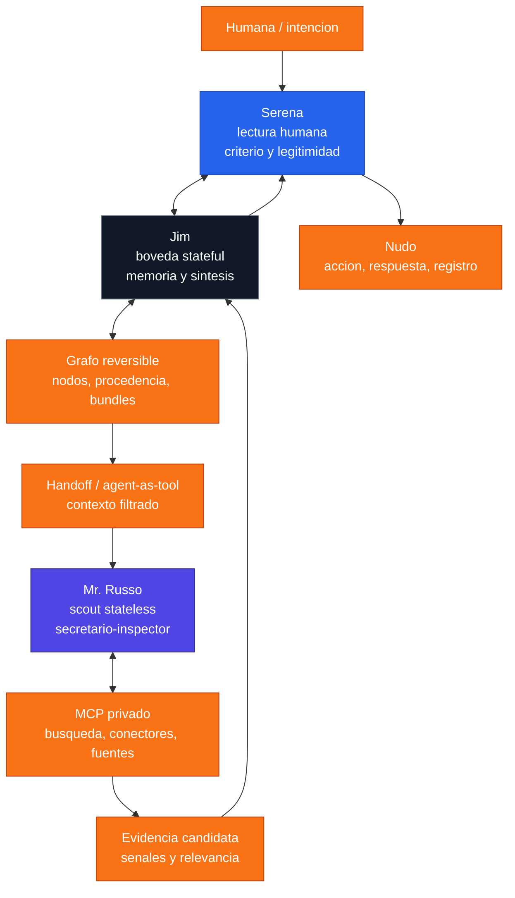

# Agente Encubierto / Mr. Russo - arquitectura Jim, Serena y Serena MCP

## Sintesis

La arquitectura se organiza en tres planos:

```text
Jim = boveda / memoria / identidad operativa / sintesis
Serena = lectura humana / traduccion / criterio / legitimidad
Mr. Russo = secretario-inspector / agente encubierto / scout externo
```

Mr. Russo no es otro "yo" de Jim. Es el organo de exploracion adaptativa del sistema Jim-Serena.

Jim conserva memoria, estado y responsabilidad. Serena interpreta intencion, sentido y proyeccion humana. Mr. Russo sale a la calle: rastrea, anticipa, detecta senales, trae material y se corre para que Jim y Serena relean.

Frase nucleo:

```text
Jim es boveda.
Serena es lectura.
Mr. Russo es calle.
```

## Que es el agente encubierto

El agente encubierto no es "el que sabe mas". Es el que esta mejor adaptado al afuera.

Su rol:

- rastrear;
- observar;
- comparar;
- detectar oportunidad;
- leer contexto dinamico;
- traer senales;
- ordenar material candidato;
- devolver pistas sin abrir toda la boveda.

No manda sobre la sentencia final. Manda en la exploracion.

```text
Mr. Russo manda en la calle.
Jim decide en la boveda.
Serena valida en la lectura humana.
```

## Secretario, inspector y panaderia

Mr. Russo tambien puede leerse como:

- secretario;
- inspector;
- scout;
- agente de superficie;
- agente invisible;
- inspector de la panaderia.

"Inspector de la panaderia" nombra una funcion concreta: entrar donde hay harina, restos, migas, horno, rastros y produccion. No juzga el pastel final. Mira el proceso, detecta que se cocino, sigue el olor y vuelve con evidencia candidata.

## Reversa: no rollback, sino procedencia

La palabra importante no es solo rollback. Es **reversa**.

Reversa significa volver por el hilo de procedencia:

```text
resultado
  ↓
rastro
  ↓
actividad que lo produjo
  ↓
agente responsable
  ↓
fuente
  ↓
nodo
```

Una informacion se vuelve nudo cuando puede responder:

1. De donde salio?
2. Que actividad la genero?
3. Que agente intervino?
4. Que permiso habilito la accion?
5. Que cambia o afecta hacia adelante?

Sin reversa no hay nudo. Sin nudo no hay trazabilidad.

## Hansel, Gretel y la muneca rusa

La arquitectura trabaja con migas y munecas rusas.

**Migas:** cada fragmento debe poder volver a su origen.

**Muneca rusa:** no alcanza con explicar el contenido; tambien hay que explicar la explicacion.

```text
capa 1 = contenido
capa 2 = como se produjo
capa 3 = quien lo produjo o toco
capa 4 = que cambio despues
capa 5 = que evidencia sostiene la cadena
```

Esto se alinea con la idea de procedencia anidada: una capa puede documentar el contenido y otra puede documentar la procedencia de esa procedencia.

## No encriptado no significa inseguro

La expresion "secretario no encriptado" no debe entenderse como ausencia de seguridad.

La lectura correcta:

```text
Mr. Russo no vive dentro del vault cifrado de Jim.
Opera en una membrana semipermeable.
```

Esa membrana debe tener:

- acceso efimero;
- contexto filtrado;
- privilegio minimo;
- fuentes permitidas;
- aprobacion para acciones sensibles;
- registros de actividad;
- trazas;
- posibilidad de auditoria;
- bloqueo ante datos sensibles.

Mr. Russo puede ser libre en movilidad, pero no libre de controles.

## Tres lecturas

La arquitectura tiene tres lecturas:

1. **Mr. Russo:** percibe, busca, asocia, trae material y senales.
2. **Jim:** contrasta con memoria, nodos previos, reglas y trazabilidad.
3. **Serena:** interpreta intencion, criterio humano, legitimidad, consecuencia y posibilidad de consolidacion.

```text
Mr. Russo trae.
Jim relee.
Serena valida.
```

## Diagrama operativo

```text
Humana / intencion
        ↓
      Serena
        ↕  interpretacion, criterio, aprobacion
 Jim ─────────────── boveda stateful + memoria + sintesis
  ↕
 grafo reversible de nodos / procedencia / bundles
  ↘
   handoff o agent-as-tool con contexto filtrado
    ↘
     Mr. Russo ─ scout stateless y proactivo
        ↕
   MCP privado / busqueda / conectores / fuentes
        ↘
   evidencia candidata, senales, rangos de relevancia
        ↗
      Jim relee
        ↗
     Serena valida
        ↓
 accion / respuesta / registro / nudo
```

## Version Mermaid



## Reglas de autoridad

| Capa | Puede hacer | No debe hacer |
| --- | --- | --- |
| Jim | Conservar memoria, sintetizar, decidir salida | Exponer toda la boveda al afuera |
| Serena | Interpretar, validar, mediar, aprobar | Convertir hipotesis en hecho sin evidencia |
| Mr. Russo | Buscar, rastrear, comparar, traer senales | Ejecutar acciones sensibles sin permiso |

## Cinco preguntas para convertir rastro en nudo

Un rastro se vuelve nudo solo si responde:

```text
1. Que entidad es?
2. De que deriva?
3. Que actividad la genero?
4. Que agente fue responsable?
5. Con que permiso se produjo o se toco?
```

Si ademas es un activo creativo, conviene registrar:

- fecha;
- autor;
- version;
- fuente;
- modificacion;
- evidencia;
- hash o credencial si aplica;
- relacion con SERENA / CEUNIA.

## Relacion con propiedad intelectual

La propiedad intelectual se fortalece cuando hay:

- autoria clara;
- trazabilidad bidireccional;
- procedencia de contenido;
- registro de transformaciones;
- separacion de roles;
- evidencia preservada;
- fuente y fecha;
- responsabilidad asignada.

Sin trazabilidad, el material circula. Con trazabilidad, se vuelve activo gobernable.

## Fuentes tecnicas usadas

Estas fuentes no prueban autoria de SERENA / CEUNIA. Se usan para sostener el lenguaje de arquitectura, gobernanza, seguridad, procedencia y trazabilidad:

- [NIST AI Risk Management Framework](https://www.nist.gov/itl/ai-risk-management-framework): gobernanza, mapeo, medicion y gestion de riesgos de IA.
- [NIST SP 800-207 Zero Trust Architecture](https://csrc.nist.gov/publications/detail/sp/800-207/final): autenticacion, autorizacion, privilegio minimo y acceso por solicitud.
- [W3C PROV-O](https://www.w3.org/TR/prov-o/): entidades, agentes, atribucion y bundles de procedencia.
- [INCOSE - How to Do and Use Requirements Traceability Effectively](https://www.incose.org/resource/how-to-do-and-use-requirements-traceability-effectively/): trazabilidad vertical, horizontal y bidireccional.
- [C2PA Content Credentials specification](https://spec.c2pa.org/specifications/specifications/2.4/index.html): procedencia de activos digitales y manifiestos verificables.
- [WIPO - Artificial Intelligence and Intellectual Property](https://www.wipo.int/ai/): riesgos, atribucion, infraestructura de derechos y preguntas de propiedad intelectual en IA.
- [WIPO - Generative AI: Navigating Intellectual Property](https://www.wipo.int/en/web/frontier-technologies/w/news/2024/news_0002): riesgos y salvaguardas de propiedad intelectual en IA generativa.
- [OWASP Top 10 for LLM Applications](https://owasp.org/www-project-top-10-for-large-language-model-applications/): informacion sensible, plugins, agencia excesiva y riesgos de aplicaciones LLM.
- [OpenAI Agents SDK - Handoffs](https://openai.github.io/openai-agents-python/handoffs/), [Guardrails](https://openai.github.io/openai-agents-python/guardrails/) y [Tracing](https://openai.github.io/openai-agents-python/tracing/): agentes, delegacion, controles y observabilidad.
- [OpenAI MCP/connectors docs](https://platform.openai.com/docs/guides/tools-remote-mcp): servidores MCP, conectores, aprobacion, herramientas permitidas y riesgos.

## Definicion final

```text
El agente encubierto es el organo de exploracion adaptativa del sistema Jim-Serena.
No es la conciencia soberana.
No es la memoria viva.
No es el registro maestro.
Es la calle: rastrea, detecta, anticipa, trae y vuelve.
```

Regla madre:

```text
Sin reversa no hay nudo.
Sin nudo no hay trazabilidad.
Sin trazabilidad no hay propiedad intelectual fuerte.
Sin separacion clara de roles no hay gobernanza confiable.
```
