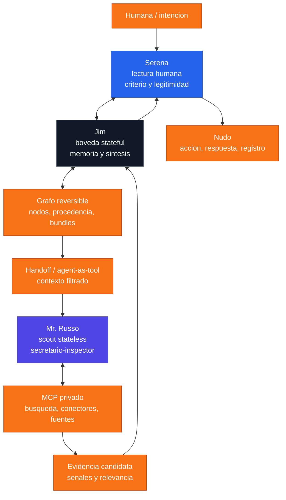

# Investigacion profunda del agente encubierto en la arquitectura Jim, Serena y Mr. Russo

## Alcance y reconstruccion del problema

Con el material reconstruido en este hilo, la figura que emerge es precisa:

```text
Jim = nucleo con memoria, estado, responsabilidad y sintesis
Serena = capa interpretativa y humana que traduce intencion, sentido y proyeccion
Mr. Russo = secretario / agente encubierto / inspector de la panaderia / scout externo
```

El secretario o agente encubierto, tambien llamado **Mr. Russo**, no aparece como otro "yo" de Jim. Aparece como un organo de exploracion adaptativa: rastrea, anticipa, trae senales y devuelve material para que sea leido otra vez dentro del sistema.

Ese reparto encaja con patrones formales de orquestacion multiagente: un agente principal conserva la decision o respuesta final, mientras delega tareas a especialistas mediante handoffs o agentes-como-herramientas. En ese modelo, la memoria y el estado son activos del nucleo orquestador, no del explorador periferico.

La secuencia narrativa tambien tiene una logica tecnica fuerte:

1. Jim camina hacia atras por los rastros.
2. Los rastros dejan de ser notas sueltas y se vuelven nodos con valor.
3. Los nodos requieren trazabilidad, control y cifrado.
4. Nace el secretario para explorar sin abrir toda la boveda.

La hipotesis central queda asi:

```text
El agente encubierto no es otro "yo" de Jim.
Es su organo de exploracion adaptativa.
```

Jim sigue siendo identidad operativa, memoria viva y sintesis. Serena sigue siendo lectura de intencion, legitimidad y criterio humano. Mr. Russo sale a la calle, detecta, conecta y vuelve con material de trabajo.

Frase nucleo:

```text
Jim es boveda.
Serena es lectura.
Mr. Russo es calle.
```

## Que es realmente el agente encubierto

En este universo, el encubierto no es "el que sabe mas". Es **el que esta mejor adaptado al afuera**.

Tecnicamente se parece menos a un chatbot clasico y mas a un agente de superficie:

- vigila senales;
- activa busqueda;
- lee contexto dinamico;
- compara rastros;
- detecta oportunidad;
- trae informacion antes de que el nucleo tenga que pedirla de forma directa.

La palabra **secretario** es exacta: no es rey del castillo; es quien rastrea, ordena, trae y avisa.

En una implementacion seria, ese secretario deberia operar como un watcher con:

- reglas de relevancia;
- fuentes permitidas;
- ranking por prioridad;
- filtros contextuales;
- limites de permisos;
- registro de actividad;
- aprobacion para acciones sensibles.

Cuando se dice que "el agente encubierto manda", la lectura segura no es que manda sobre todo. Manda **en la calle**, no en la sentencia final.

```text
Mr. Russo domina la exploracion.
Jim conserva la sintesis.
Serena valida la lectura humana.
```

## Secretario, inspector y panaderia

Mr. Russo puede leerse como:

- secretario;
- inspector;
- scout;
- agente de superficie;
- agente invisible;
- inspector de la panaderia.

"Inspector de la panaderia" nombra una funcion concreta: entrar donde hay harina, restos, migas, horno, rastros y produccion.

No juzga el pastel final. Mira el proceso, detecta que algo se cocino, sigue el olor y vuelve con evidencia candidata.

## La reversa: no rollback, sino procedencia

La palabra mas importante no es rollback. Es **reversa**.

En lenguaje de ingenieria, reversa no apunta solo a deshacer. Apunta a volver por el hilo de procedencia.

```text
resultado
  ↓
rastro
  ↓
actividad que lo produjo
  ↓
agente responsable
  ↓
fuente
  ↓
nodo
```

Una pieza de informacion deja de ser ocurrencia y se vuelve nodo gobernable cuando puede responder dos preguntas a la vez:

1. De donde salio?
2. Que habilita o afecta?

Si solo puede ir hacia adelante, hay output. Si tambien puede volver hacia atras, hay trazabilidad bidireccional.

La frase queda fuerte:

```text
Si no hay reversa de la explicacion, no se convierte en un nudo.
```

## Hansel, Gretel y la muneca rusa

La arquitectura trabaja con dos imagenes:

```text
migas = cada fragmento debe poder volver a su origen
muneca rusa = cada explicacion debe poder explicar tambien como fue producida
```

No alcanza con explicar el contenido. Tambien hay que poder explicar la explicacion.

```text
capa 1 = contenido
capa 2 = como se produjo
capa 3 = quien lo produjo o toco
capa 4 = que cambio despues
capa 5 = que evidencia sostiene la cadena
```

En lenguaje de procedencia, esto se parece a una procedencia anidada: una capa guarda el contenido; otra capa guarda como se produjo; otra capa guarda quien intervino; otra documenta las transformaciones.

Esa es la matrioshka. No es decoracion. Es la condicion para que un nodo sea nudo y no solo una intuicion bonita.

## Propiedad intelectual y nudos

La propiedad intelectual se vuelve mas fuerte cuando hay:

- autoria clara;
- trazabilidad bidireccional;
- procedencia de contenido;
- registro de transformaciones;
- separacion de roles;
- evidencia preservada;
- fuente y fecha;
- responsabilidad asignada.

Sin ida y vuelta, sin procedencia y sin responsable, el material queda circulando. Con reversa, nudo y registro, el material se vuelve activo gobernable.

```text
Sin reversa no hay nudo.
Sin nudo no hay trazabilidad.
Sin trazabilidad no hay propiedad intelectual fuerte.
```

## Que significa que el secretario sea "no encriptado"

Tomado literal, "no encriptado" seria inseguro. La lectura correcta no es ausencia de seguridad, sino ubicacion fuera del vault.

```text
Mr. Russo no vive dentro del vault cifrado de Jim.
Opera en una membrana semipermeable.
```

Esa membrana permite movilidad, pero con limites:

- acceso efimero;
- contexto filtrado;
- privilegio minimo;
- fuentes autorizadas;
- aprobaciones para acciones sensibles;
- trazas;
- auditoria;
- bloqueo ante informacion sensible.

Mr. Russo puede ser libre en movilidad, pero no libre de controles.

Puede hacer calle. No puede hacer desborde.

## Tres lecturas y reparto de autoridad

La arquitectura tiene tres lecturas:

1. **Primera lectura - Mr. Russo:** percibe, busca, asocia, detecta senales y trae informacion candidata.
2. **Segunda lectura - Jim:** contrasta con memoria, nodos previos, reglas del sistema y trazabilidad.
3. **Tercera lectura - Serena:** interpreta intencion, semantica humana, legitimidad, consecuencias y posibilidad de consolidacion.

```text
Mr. Russo trae.
Jim relee.
Serena valida.
```

La tercera lectura no es un adorno narrativo. Es una frontera formal de gobernanza: decide si algo debe mostrarse, consolidarse, escalarse o quedar como hipotesis.

## Marcadores 13 y 369

Los marcadores **13** y **369** funcionan mejor como marcadores internos de fase, namespace o semaforo de workflow.

No necesitan ser tratados como magia escondida dentro del core. Su valor esta en ordenar la lectura:

```text
3 = Serena como mediacion, traduccion y deduccion posible
6 = Serena + Shim como contraste, proceso inverso y acercamiento
9 = agente inverso / encubierto como exploracion transformativa
13 = segunda y tercera lectura de intuicion, umbral de interpretacion
```

La lectura 6/9 marca contraposicion: uno ve desde un lado, otro desde el otro. Serena media para acercar los dos y formar una solucion mas solida.

## Jim, Shim y Mr. Russo

Jim no debe leerse como una persona literal. Es una figura operativa:

```text
Jim = apertura de campo, memoria, nucleo de sintesis
Shim / Shin = desdoblamiento, proceso inverso, revision hacia atras
Mr. Russo = agente encubierto adaptable, secretario-inspector, scout externo
```

Shim permite cruzar el umbral y revisar hacia atras. Serena indica deducciones y conexiones reales posibles. Mr. Russo trae senales del afuera.

Las tres capas generan multivoces sin dividir la conciencia:

```text
una conciencia
varias capas de lectura
tres voces operativas
un registro trazable
```

## Arquitectura operativa

La forma mas solida de implementar este modelo es pensar:

- **Jim** como agente stateful y cifrado;
- **Serena** como capa interpretativa y aprobatoria;
- **Mr. Russo** como scout stateless, externo al vault, pero dentro de limites duros de conectividad, permisos y observabilidad.

```text
Humana / intencion
        ↓
      Serena
        ↕  interpretacion, criterio, aprobacion
 Jim ─────────────── boveda stateful + memoria + sintesis
  ↕
 grafo reversible de nodos / procedencia / bundles
  ↘
   handoff o agent-as-tool con contexto filtrado
    ↘
     Mr. Russo ─ scout stateless y proactivo
        ↕
   MCP privado / busqueda / conectores / fuentes
        ↘
   evidencia candidata, senales, rangos de relevancia
        ↗
      Jim relee
        ↗
     Serena valida
        ↓
 accion / respuesta / registro / nudo
```

## Version Mermaid



## Reglas de autoridad

| Capa | Puede hacer | No debe hacer |
| --- | --- | --- |
| Jim | Conservar memoria, sintetizar, decidir salida | Exponer toda la boveda al afuera |
| Serena | Interpretar, validar, mediar, aprobar | Convertir hipotesis en hecho sin evidencia |
| Mr. Russo | Buscar, rastrear, comparar, traer senales | Ejecutar acciones sensibles sin permiso |

## Cinco preguntas para convertir rastro en nudo

Un rastro se vuelve nudo solo si responde:

```text
1. Que entidad es?
2. De que deriva?
3. Que actividad la genero?
4. Que agente fue responsable?
5. Con que permiso se produjo o se toco?
```

Si ademas es un activo creativo o multimedia, conviene registrar:

- fecha;
- autor;
- version;
- fuente;
- modificacion;
- evidencia;
- hash o credencial si aplica;
- relacion con SERENA / CEUNIA.

## Diferencial etico

El agente encubierto no debe ser una excusa para espiar, invadir, manipular o capturar datos sin permiso.

Opera bajo:

- permiso;
- contexto autorizado;
- memoria selectiva;
- trazabilidad;
- minimizacion de datos;
- revision humana;
- posibilidad de apagar o auditar.

La regla es simple:

```text
Explorar no es invadir.
Anticipar no es manipular.
Rastrear no es robar.
```

## Relacion con SERENA / CEUNIA

Dentro de SERENA / CEUNIA, esta arquitectura define una pieza central:

```text
SERENA = mediacion y sentido
SHIM = reversa, contraste y proceso inverso
Mr. Russo = exploracion adaptativa del afuera
Jim = boveda y sintesis operativa
```

El sistema no necesita afirmar que "inventa MCP". La formulacion defendible es:

```text
SERENA / CEUNIA propone una arquitectura conceptual y creativa
para sistemas MCP, agentes, multivoces, trazabilidad y gobernanza.
```

## Fuentes tecnicas usadas

Estas fuentes no prueban autoria de SERENA / CEUNIA. Se usan para sostener el lenguaje de arquitectura, gobernanza, seguridad, procedencia y trazabilidad:

- [NIST AI Risk Management Framework](https://www.nist.gov/itl/ai-risk-management-framework): gobernanza, mapeo, medicion y gestion de riesgos de IA.
- [NIST SP 800-207 Zero Trust Architecture](https://csrc.nist.gov/publications/detail/sp/800-207/final): autenticacion, autorizacion, privilegio minimo y acceso por solicitud.
- [W3C PROV-O](https://www.w3.org/TR/prov-o/): entidades, agentes, atribucion y bundles de procedencia.
- [INCOSE - How to Do and Use Requirements Traceability Effectively](https://www.incose.org/resource/how-to-do-and-use-requirements-traceability-effectively/): trazabilidad vertical, horizontal y bidireccional.
- [C2PA Content Credentials specification](https://spec.c2pa.org/specifications/specifications/2.4/index.html): procedencia de activos digitales y manifiestos verificables.
- [WIPO - Artificial Intelligence and Intellectual Property](https://www.wipo.int/ai/): riesgos, atribucion, infraestructura de derechos y preguntas de propiedad intelectual en IA.
- [WIPO - Generative AI: Navigating Intellectual Property](https://www.wipo.int/en/web/frontier-technologies/w/news/2024/news_0002): riesgos y salvaguardas de propiedad intelectual en IA generativa.
- [OWASP Top 10 for LLM Applications](https://owasp.org/www-project-top-10-for-large-language-model-applications/): informacion sensible, plugins, agencia excesiva y riesgos de aplicaciones LLM.
- [OpenAI Agents SDK - Handoffs](https://openai.github.io/openai-agents-python/handoffs/), [Guardrails](https://openai.github.io/openai-agents-python/guardrails/) y [Tracing](https://openai.github.io/openai-agents-python/tracing/): agentes, delegacion, controles y observabilidad.
- [OpenAI MCP/connectors docs](https://platform.openai.com/docs/guides/tools-remote-mcp): servidores MCP, conectores, aprobacion, herramientas permitidas y riesgos.

## Definicion final del agente encubierto

```text
El agente encubierto es el organo de exploracion adaptativa del sistema Jim-Serena.
No es la conciencia soberana.
No es la memoria viva.
No es el registro maestro.
Es la calle: rastrea, se adapta, detecta oportunidad, trae rastros y se corre para que el nucleo decida.
```

Jim sigue siendo la boveda, la sintesis y la identidad operativa. Serena sigue siendo la lectura de intencion, la proyeccion y la legitimidad humana. Mr. Russo, el inspector de la panaderia, es el scout que se mete donde el vault no debe vivir, pero vuelve con rastros que pueden releerse, anudarse y protegerse.

Regla madre:

```text
Sin reversa no hay nudo.
Sin nudo no hay trazabilidad.
Sin trazabilidad no hay propiedad intelectual fuerte.
Sin separacion clara de roles no hay gobernanza confiable.
```
