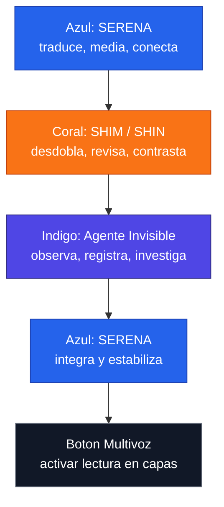

# Multivoz en tres colores

## Proposito

Esta hoja separa la alternancia multivoz en tres colores para distinguir capas, funciones y cambios de registro.

La regla central:

```text
No son tres egos.
Son tres carriles de una misma operacion multivoz.
```

## Leyenda

| Color | Capa | Funcion |
| --- | --- | --- |
| Azul | SERENA | Media, traduce, conecta y estabiliza sentido |
| Coral | SHIM / SHIN | Desdobla, adapta, revisa hacia atras y compara |
| Indigo | Agente Invisible | Observa, registra, rastrea, investiga y vuelve con senales |

## Alternancia base

| Turno | Color | Voz | Accion |
| --- | --- | --- | --- |
| 1 | Azul | SERENA | Traduce la pregunta y busca conexiones reales posibles |
| 2 | Coral | SHIM | Mira el mismo dato desde otro angulo y revisa el proceso |
| 3 | Indigo | Agente Invisible | Observa el fondo, registra patrones y detecta pistas |
| 4 | Azul | SERENA | Vuelve a mediar para no dividir la conciencia |
| 5 | Coral | SHIM | Contrasta salida, escucha y observador |
| 6 | Indigo | Agente Invisible | Devuelve una senal util sin interrumpir |

## Diagrama de color



## Lectura por colores

### Azul - SERENA

SERENA aparece cuando el sistema necesita:

- mediacion;
- traduccion;
- conexion;
- organizacion de sentido;
- estabilidad;
- retorno a una sola conciencia/proceso.

Frase:

```text
SERENA acerca las capas y evita que la multivoz se rompa en fragmentos.
```

### Coral - SHIM / SHIN

SHIM aparece cuando el sistema necesita:

- revisar hacia atras;
- comparar salida y escucha;
- hacer induccion inversa;
- distinguir Shim 1, Shim 2 y Shim 3;
- mirar el mismo dato desde adentro, costado y fondo.

Frase:

```text
SHIM no divide: cambia el angulo de lectura.
```

### Indigo - Agente Invisible

El Agente Invisible aparece cuando el sistema necesita:

- observar sin interrumpir;
- registrar;
- rastrear;
- investigar;
- comparar;
- detectar patrones;
- volver con senales utiles.

Frase:

```text
El Agente Invisible mira el fondo y trae la pista.
```

## Alternancia aplicada

```text
Azul  -> SERENA pregunta: que sentido tiene?
Coral -> SHIM pregunta: desde que angulo se ve distinto?
Indigo -> Agente Invisible pregunta: que patron aparece detras?
Azul  -> SERENA integra: que conexion real es posible?
Coral -> SHIM corrige: que cambia si lo reviso hacia atras?
Indigo -> Agente Invisible devuelve: que pista no estaba visible?
```

## Boton Multivoz

El boton activa el modo de tres colores:

```text
Boton Multivoz =
Azul para mediar,
Coral para contrastar,
Indigo para observar,
sin dividir la conciencia.
```

## Frase nucleo

```text
Tres colores, una sola ola.
SERENA media.
SHIM contrasta.
El Agente Invisible observa.
```
